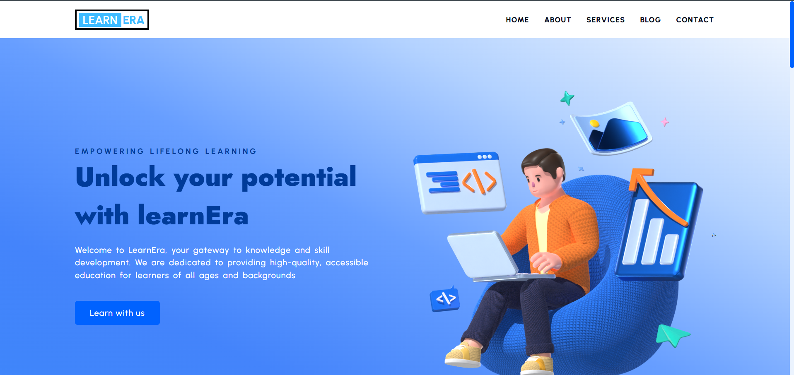

# Learnera 🎓

**Learnera** is a clean, responsive educational website made using HTML5 and CSS3. It features an elegant layout with sections like About, Services, Contact, and Why Choose Us — perfect for learners or institutions. This was my first project while learning front-end development.

---

## 🌐 Live Demo

🔗 [Visit Learnera](https://udaysingh07707.github.io/LearnEra/)

---

## 📸 Preview

---

## ✨ Features

- 🎯 Fully responsive design
- ⚡ Smooth hover animations (scale, rotate)
- 🎨 Custom favicon included
- 🧩 Clean code structure using only HTML + CSS
- 📱 Mobile-friendly layout

---

## 📁 Project Structure

LearnEra/
├── index.html
├── about.html
├── contact.html
├── services.html
├── css/
│ └── style.css
├── media/
│ └── (all .png images here)

---

## 🔧 Built With

- HTML5
- CSS3
- GitHub Pages (for hosting)

---

## 🙋‍♂️ About This Project

I made **Learnera** as my very first website project. It helped me learn:
- Semantic HTML
- CSS positioning and transitions
- Responsive layouts
- Hosting with GitHub Pages

This is the first step in my journey toward becoming a full-stack web developer by 2028.

---

## ✍️ Author

- 👤 Uday Singh
- 🌐 [LinkedIn](https://www.linkedin.com/in/your-link)
- 📧 udaysingh8790@gmail.com 

---

## 📜 License

This project is open-source and available under the [MIT License](LICENSE).